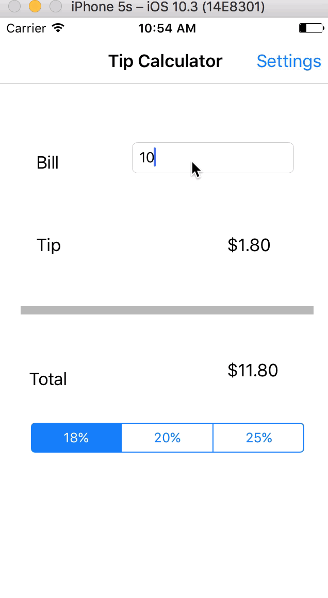

# Pre-work - *Tip Calculator*

**Tip Calculator** is a tip calculator application for iOS.

Submitted by: **Mengyao Wang**

Time spent: **5** hours spent in total

## User Stories

The following **required** functionality is complete:

* [x] User can enter a bill amount, choose a tip percentage, and see the tip and total values.
* [x] Settings page to change the default tip percentage.

The following **optional** features are implemented:
* [ ] UI animations
* [ ] Remembering the bill amount across app restarts (if <10mins)
* [ ] Using locale-specific currency and currency thousands separators.
* [ ] Making sure the keyboard is always visible and the bill amount is always the first responder. This way the user doesn't have to tap anywhere to use this app. Just launch the app and start typing.

The following **additional** features are implemented:

- [ ] List anything else that you can get done to improve the app functionality!

## Video Walkthrough 

Here's a walkthrough of implemented user stories:

## Project Analysis

As part of your pre-work submission, please reflect on the app and answer the following questions below:

**Question 1**: "What are your reactions to the iOS app development platform so far? How would you describe outlets and actions to another developer? Bonus: any idea how they are being implemented under the hood? (It might give you some ideas if you right-click on the Storyboard and click Open As->Source Code")

**Answer:** iOS platform heavily depends on drag and drop. ViewController talks to View by using Outlet. We can set UI component of View objects thru Outlet. View pass on messages about view to ViewController by using Action, which normally being used as a event trigger for updating states.

Question 2: "Swift uses [Automatic Reference Counting](https://developer.apple.com/library/content/documentation/Swift/Conceptual/Swift_Programming_Language/AutomaticReferenceCounting.html#//apple_ref/doc/uid/TP40014097-CH20-ID49) (ARC), which is not a garbage collector, to manage memory. Can you explain how you can get a strong reference cycle for closures? (There's a section explaining this concept in the link, how would you summarize as simply as possible?)"

**Answer:** ARC tracks how many properties, constants, and variables are currently referring to each class instance, if number of references > 1, ARC will not free up the space the instancee occupies.
